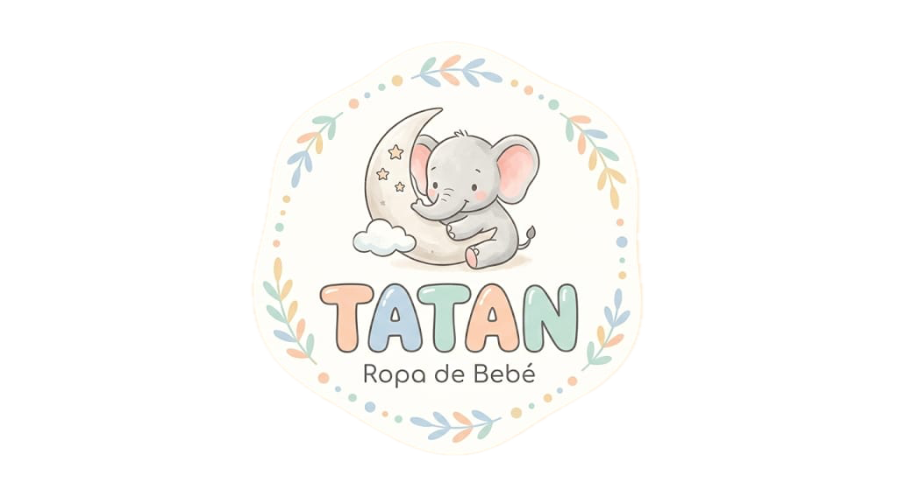

# Tatan — Web Oficial

Este repositorio contiene la web oficial de Tatan, una marca de ropa para niños.

## Alcance

- Venta online en Argentina.
- CRM exclusivo para el personal de Tatan, con detalle de ventas, inventario y herramientas de organización.

## Tecnologías

- TypeScript
- Tailwind CSS
- i18n

## Identidad visual

### Logo



### Colores

- Primario 1: `#FCD1B1`
- Primario 2: `#C7E2D6`
- Primario 3: `#C6E1D3`
- Fondo: `#FEFDF8`

<table>
  <thead>
    <tr>
      <th>Nombre</th>
      <th>Hex</th>
      <th>Muestra</th>
    </tr>
  </thead>
  <tbody>
    <tr>
      <td>Primario 1</td>
      <td><code>#FCD1B1</code></td>
      <td><div style="width: 48px; height: 20px; background: #FCD1B1; border: 1px solid #ddd;"></div></td>
    </tr>
    <tr>
      <td>Primario 2</td>
      <td><code>#C7E2D6</code></td>
      <td><div style="width: 48px; height: 20px; background: #C7E2D6; border: 1px solid #ddd;"></div></td>
    </tr>
    <tr>
      <td>Primario 3</td>
      <td><code>#C6E1D3</code></td>
      <td><div style="width: 48px; height: 20px; background: #C6E1D3; border: 1px solid #ddd;"></div></td>
    </tr>
    <tr>
      <td>Fondo</td>
      <td><code>#FEFDF8</code></td>
      <td><div style="width: 48px; height: 20px; background: #FEFDF8; border: 1px solid #ddd;"></div></td>
    </tr>
  </tbody>
</table>

## Gestión de dependencias

Se ruega usar siempre `pnpm` en lugar de `npm`, por temas de seguridad relacionados con las últimas noticias de npm al 15 de mayo de 2026.

## Cómo iniciar el proyecto (pnpm)

### Requisitos

- Node.js instalado
- `pnpm` (recomendado vía Corepack)

### Instalar pnpm con Corepack (recomendado)

```bash
corepack enable
corepack prepare pnpm@latest --activate
pnpm --version
```

### Instalar dependencias

```bash
pnpm install
```

### Levantar el entorno de desarrollo

```bash
pnpm dev
```

### Scripts útiles

```bash
pnpm lint
pnpm build
pnpm start
```

### Nota sobre npm

- Evitar `npm install` / `npm ci` en este repo.

## Estructura de carpetas

Estructura principal del proyecto (puede crecer con el tiempo):

```text
app/            # Rutas, layouts y páginas (App Router)
public/         # Assets estáticos servidos tal cual (imágenes, íconos, etc.)
assets/         # Assets “importables” desde TS/TSX
components/     # Componentes reutilizables de UI
data/           # Datos estáticos, mocks, seeds y catálogos (TS/JSON)
hooks/          # Custom hooks reutilizables
```

### `app/`

- Contiene las rutas de la web (y del CRM si aplica), junto con layouts y páginas.

### `public/` (assets estáticos)

- Archivos estáticos accesibles por URL (por ejemplo `/logo.svg`).
- Ideal para imágenes, íconos, fuentes y recursos que no necesitan pasar por el bundle.

### `assets/` (opcional)

- Assets que se importan desde el código (por ejemplo `import hero from "@/assets/hero.png"`), si el proyecto decide centralizarlos.
- Si no se necesita, usar `public/` directamente.

### `components/`

- Componentes reutilizables y agnósticos de la página (botones, inputs, modales, cards, etc.).

### `data/`

- Fuentes de datos locales: catálogos, constantes, mocks para desarrollo, fixtures, etc.
- Preferir tipado en TypeScript.

### `hooks/`

- Hooks reutilizables (por ejemplo: estado de UI, helpers de fetch, permisos, utilidades del CRM).
- Evitar que dependan de páginas específicas para mantenerlos componibles.
